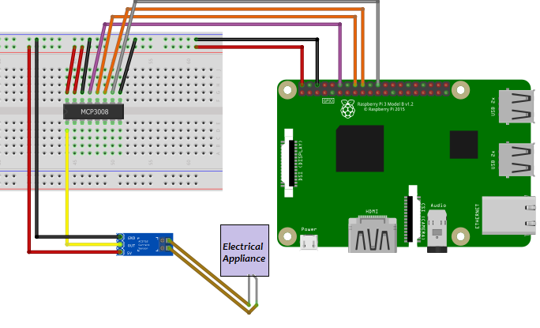
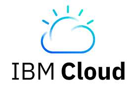
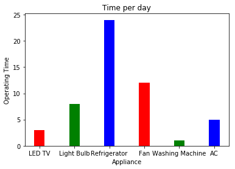
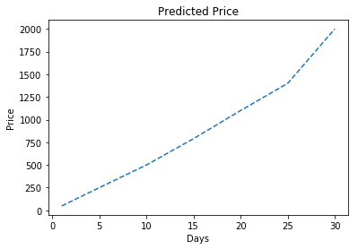

# Electro-Model

1. First step is the basic setup -- i.e. connection of current sensor with the appliances and assigning them a unique QR code.

2. Second step is to scan the QR code from the app installed in the user's phone. 
  

3. Connect your raspberry to the wifi.

4. As the code will run , the readings of the energy consumed by each appliance can be seen by the user on the app and the total cost can also be predicted with the help of neural network. These readings are transferred from the sensor to the app with the help of IBM cloud. 
  

BASIC LAYOUTS: 

